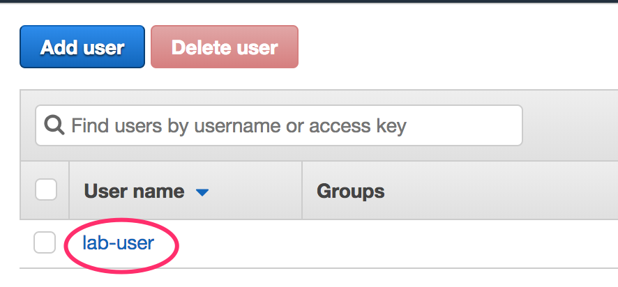
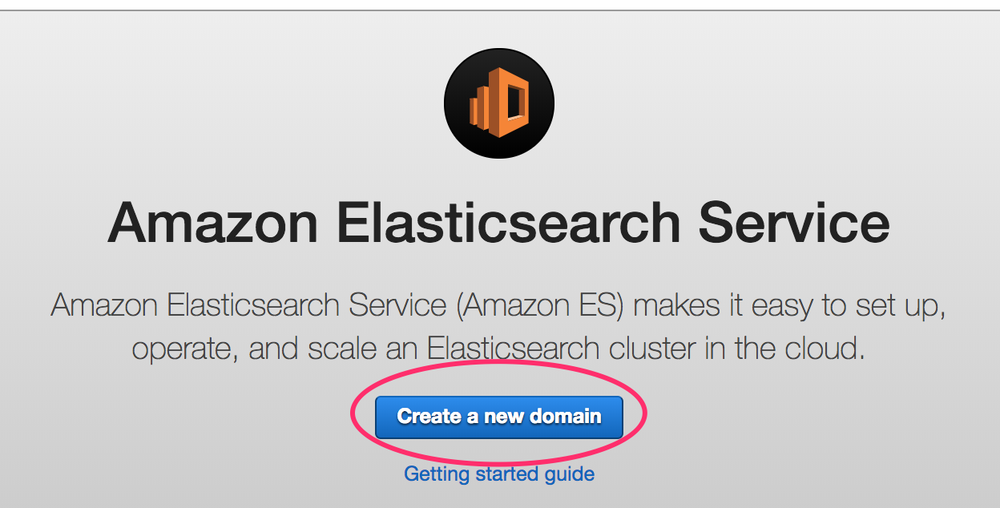
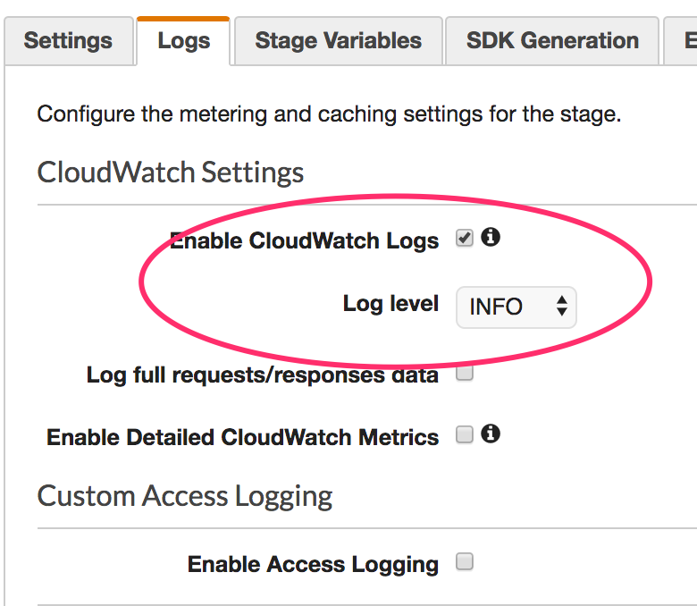
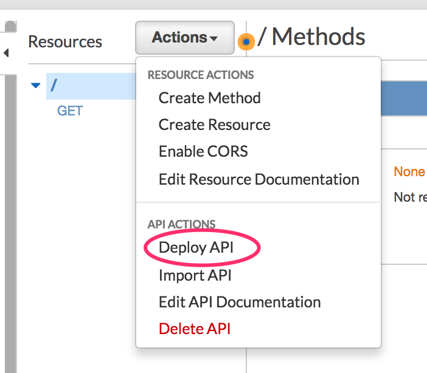

## Elasticsearch Immersion Day Workshop

Welcome to the Elasticsearch Immersion Day workshop.

In this workshop we will be doing 6 things: 
1. `Launching` an Elasticsearch Cluster
2. `Ingesting` a large set of movie data into Elasticsearch
3. Publishing an `API` for searching the movie data
4. `Ingesting` access logs from the API into Elasticsearch
5. Building a `Website` to search for movies
6. Using Kibana to Search and Visualise both the Movie Data and our API Access Logs

This project is broken up into 3 sub-projects, which will be used throughout the workshop:

1. `imdb-publish/` is a nodejs app to publish a JSON file of documents to elasticsearch.
2. `imdb-lambda/` is a [SAM](https://github.com/awslabs/serverless-application-model) managed Lambda + API Gateway to provide the movie search service.
3. `imdb-search/` is a ReactJS webapp to facilitate searching for movies.


## Part 0: Prepare your Account

Before we launch our Elasticsearch cluster, we'll need to first setup a few things.

Start by logging into the AWS console using the credentials + signin URL that you've been given.

Now that you've logged in, you need to do 3 things to prepare your account: 
1. Create an `Access Key + Secret Key` - which you will use when ingesting data into cluster
2. Create a Cognito User Pool user - which will allow you to access kibana later

### Create the Cognito User Pool
Head over to the `Cognito` console.

Make sure you're in the `Sydney` region, and then click on "Manage User Pool".


Next, click on the "imdb-kibana-users" pool button. 


Click on "Users and Groups" from the sidebar menu, and add a user for yourself.

### Create an Access Key + Secret Key

Head over to the IAM console, and open the Users section.
Click on the 'lab-user' user.


Click on the Security Credentials tab.


Click on the "Create Access Key" button to generate a new Access Key + Secret Key.
Keep a copy of these, you'll need them later.


## Part 1: Launch the Elasticsearch Cluster

Head over to the Elasticsearch Console.

Make sure you're in the `Sydney` region, and then click on "Create a new Domain".



Now, follow the wizard to create your cluster.

On the first page: 
- Name: imdb-movies
- Version: 6.2

On the second page: 
- Instance Count: 1
- Instance Type: m4.large.elasticsearch
- EBS Volume Size: 32GB
- No Dedicated Master, No Zone Awareness

On the third page: 
- Network Configuration: Public Access
- Tick the enable Cognito for authentication
  - Select the Cognito User + Identity Pools

- Add + update the following access policy

```JSON
{
  "Version": "2012-10-17",
  "Statement": [
    {
      "Effect": "Allow",
      "Principal": {
        "AWS": "arn:aws:iam::123456789012:user/lab-user"
      },
      "Action": "es:*",
      "Resource": "arn:aws:es:ap-southeast-2:123456789012:domain/imdb-movies/*"
    },
    {
      "Effect": "Allow",
      "Principal": {
        "AWS": "arn:aws:iam::123456789012:role/lambda_imdb_role"
      },
      "Action": "es:*",
      "Resource": "arn:aws:es:ap-southeast-2:123456789012:domain/imdb-movies/*"
    },
    {
      "Effect": "Allow",
      "Principal": {
        "AWS": 
        "arn:aws:sts::123456789012:assumed-role/Cognito_IMDBKibanaUsersAuth_Role/CognitoIdentityCredentials"
      },
      "Action": "es:*",
      "Resource": "arn:aws:es:ap-southeast-2:123456789012:domain/imdb-movies/*"
    }
  ]
}
```

This access policy will allow the following: 
- Your IAM User
- The Lambda Role we created before
- The Role assumed by users of our Cognito User Pool 

**TIP**: You'll need to update the policy with the ARN's specific to your account (update the account numbers)
**Tip** You can get your Accout number by running this CLI Command: `aws sts get-caller-identity`

Click Next, and then Confirm to launch your Elasticsearch cluster.

Your cluster should now be in the process of being created.


That's it for this part of the workshop, please wait before proceeding.

## Part 2: Ingest The IMDB Movie Database

In this phase, we're going to ingest a copy of all the movies from IMDB into our Elasticsearch cluster.

You will need to download a copy of the Elasticsearch Movie Dataset from here: [IMDB Movie Dataset](https://s3-ap-southeast-2.amazonaws.com/isv-labs/imdb-movies.json.zip), and unzip it (75MB).

Open the `imdb-publish` directory in your local git repo. In this folder is a small NodeJS script to ingest the movie dataset. 

From this directory, try running: ```node index```

You should be presented with the help for this script, which includes a description of the arguments that you'll need to specify.

Now, run the script again, this time specifying the following arguments: `domain, key, secret, ingest-file`

You should see some console logs indicating that documents are being ingested into your cluster, 1,000 documents at a time (there's about 400k documents). 


### Ingesting Data using the Bulk API

You could ingest the documents into elasticsearch one document at a time, like this: 
eg. 
```BASH
$ curl -XPOST 'https://<es-endpoint>/<index>/<documentType>/<documentId>' -d'
{
  "name": "Fight Club",
  "releaseYear": 1999,
  "rating": 8.9, 
  "crew": [{
    "name": "David Fincher",
    "job": "Director"
  },{
    "name": "Jim Uhls",
    "job": "Screenplay"
  }],
  ...
}'
```

However, this would be very inefficient if you needed to ingest a large number of documents - like we do.

To more efficiently ingest data into Elasticsearch, we'll use the bulk endpoint `_bulk`, that allows us to peform multiple operations in a single HTTP request.

The Bulk endpoint is located at: https://<es-endpoint>`/_bulk`
eg. https://imdb-movies-jhgatgpoksdfrghtbhkeld5gss.ap-southeast-2.es.amazonaws.com/_bulk

When POSTing to the _bulk endpoint, you use a `new-line-delimited JSON` format (x-nld-json), which is a single JSON document per line in the body of the requst.

The documents in the body of the request follow a 2 document pattern of: 
- `operation document` - A JSON specifying the operation to perform (eg. index)
- `document` - The JSON for which the operation applies (eg. the document to index)

eg. The following 2 documents will `index` the "Awesome Movie" document into the `imdb`: 
```
{ index:  { _index: "imdb", _type: "movie" } }
{ name:"Awesome Movie", releaseYear:2018, etc... }
```


That's it for this part of the workshop, please wait before proceeding.

## Part 3: Create our Movie Search API

Now that we have all our movies in our elasticsearch cluster, we can create an API to facilitate searching them.

Open up the `imdb-lambda` directory.

This application uses [AWS SAM](https://github.com/awslabs/serverless-application-model) to configure and deploy an AWS API Gateway and an AWS Lambda function.

Open up the `template.yaml` file, which is the SAM template. This file tells AWS SAM to setup an API gateway and to deploy the current directory as a lambda.

Update the `domain` environment variable to match your Elasticsearch clusters' domain URL.
Then, update the account number in the ROLE ARN to match your account number.

Note: You can get your Accout number by running this CLI Command: `aws sts get-caller-identity`

Head over to the AWS console, open up the S3 console page, and create a new bucket - give it a unique name like: `johns-aws-artifacts`

Now that you've created an S3 bucket, we're going to use that bucket to host our code builds. 

Open up the `deploy.sh` file, and update the S3_Bucket variable to match your new S3 bucket name

After doing that, you can execute that file to package + deploy the Lambda + API Gateway: `./deploy.sh`

Once your API Gateway and Lambda have been created, you can test out your API in the browser.

Open up the `API Gateway` console. Open your API (imdb-search), click on "Stages", then on Prod.

The URL of your API should be displayed.


Open that URL in your browser, and append this to the end: `?criteria=star%20wars`
You should see some Star Wars movies.


## Part 4: Push API Access Logs into Elasticsearch

Head over the `CloudWatch` console and click on Logs.

Click on the "Actions" button, and select "Create log group".
Name your log group: `imdb-search-accesslog`

Now, head back to the API Gateway console, because we now need to turn on Access Logs.

In the Prod stage (where you just were), click on the "Logs" tab.
 

Tick the "Enable CloudWatch Logs" setting, change the level to "INFO".


Next, click Enable Access Logging, specify your log group ARN and click the JSON button to set the log format to JSON.

Note: The ARN format for a log group will be something like this: `arn:aws:logs:ap-southeast-2:<account number>:log-group:imdb-search-accesslog`


Click "Save Changes" to save your new settings.

Next Click on the "Resources" menu item.

We're going to add an OPTIONS request handler to enable cors.

Click on the "Actions" button, and select "Enable CORS", then click on "Enable CORS and replace existing CORS headers".

After making these changes, we need to re-deploy our API gateway. 
You can do this by clicking on the "Actions" button and selecting "Deploy API" (select the Prod stage to deploy to)


Now, head back to your API in the browser, and give it a few more hits.

Back in the `CloudWatch` console, select your log group, then click the Actions button.

Select "Stream to Amazon Elasticsearch".


Select your elasticsearch cluster, and the Lambda role called: "lambda_imdb_role"

In the log format settings page, select the log format: "Other" 

We're selecting this format becasue the API gateway has already output the log as JSON so we don't need to do any transformations on the logs before they head off to ES.


That's it for this part of the workshop, please wait before proceeding.


## Part 5: Build a Website to search for Movies 

Open up the `imdb-search` directory.

This is a basic ReactJS Webapplication.

Open up the `src/App.js` file - this is where all the juicy bits of this application live, including the URL to your API.

Update the `API_URL` variable with your API's URL.

When you're ready, you can run `npm run build` in the `imdb-search` folder to build your website.

Now, create an S3 bucket to host your website. In the bucket enable Static website hosting. 
Then add the following bucket policy to the bucket (updating the bucket name): 
```JSON
{
  "Version":"2012-10-17",
  "Statement":[{
	"Sid":"PublicReadGetObject",
    "Effect":"Allow",
	  "Principal": "*",
      "Action":["s3:GetObject"],
        "Resource":["arn:aws:s3:::bucketname/*"
      ]
    }
  ]
}
```

Then, upload the contents of the `build` directory into this bucket using the command: `aws s3 sync . s3://bucketname/`

Your website is now available at the following URL: `http://<bucket-name>.s3-website-ap-southeast-2.amazonaws.com`

Try searching for a movie :-)

## Part 6: Using Kibana

Open up the Elasticsearch console, and click on the Kibana URL.

You should be presented with a Login window, login using the user you created at the beginnig of the day.

Voila, you're now in Kibana :-)

There are two index patterns you want to setup: 
* imdb  - This is to facilitate searching / visualising the movie documents
* cwl*  - This is to facilitate searching / visualising the Access Logs to your API

